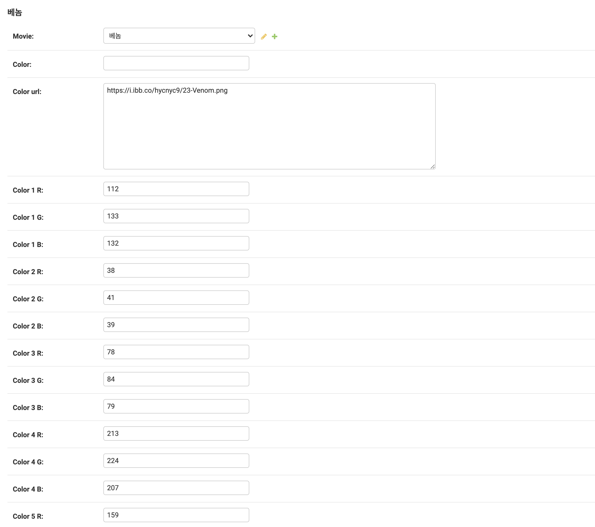

<h1 align="center" style="max-width: 100%;">
  <br/>
  <a href="https://www.prismfilmstudio.com">             www.prismfilmstudio.com</a>
</h1>


###                                  [**클러스터링 기반 색채 추출 및 계산**](#색채-데이터-만들기) / [**음성인식**](#음성인식) / [**드로잉**](#드로잉)

<p align="center">
  <b>SSAFY 1학기 최종 프로젝트(21.11.17 ~ 21.11.24)</b><br /></p>


<p align="center">
  <b>Supported</b><br/>
  <a href="#"></a>&nbsp;&nbsp;
  <a href="#"></a>&nbsp;&nbsp;
  <a href="#"></a>&nbsp;&nbsp;
  <a href="#"></a>&nbsp;&nbsp;
  <a href="#"></a>
</p>


<table style="table-layout: fixed; overflow-wrap: break-word;">
  <tbody>
    <tr>
      <td><a href="#" target="_blank"></a></td>
      <td><a href="#" target="_blank"></a></td>
      <td rowspan="2" style="display:flex-column;"><div style="height:15px;"></div></div></td>
    </tr>
    <tr>
      <td colspan="2"><a href="#" target="_blank"></a></td>
    </tr>
  </tbody>
</table>
<h6 align="center">
  www.prismfilmstudio.com <a href="https://prismfilmstudio.com"></a>
</h6>


-----


## ✨ Stack

#### 주요  Stack

|                        Content                         |           Main            |                          Detail                          |
| :----------------------------------------------------: | :-----------------------: | :------------------------------------------------------: |
|               [**음성인식**](#음성인식 )               | Python 3.9.6 / JavaScript |             webkitSpeechRecognition / Axios              |
|                 [**드로잉**](#드로잉)                  |        JavaScript         |                Canvas / Blob Data/ Axios                 |
|                       [**FE**]()                       |  HTML / CSS / JavaScript  |            Django 3.2.9 / HTML5 / CSS3 / ES6             |
|         [**클러스터링**](#색채-데이터-만들기)          |  C# .Net Framework 4.7.2  |            C#(OpenCvSharp4 - V4.5.3.20210817)            |
| [**RGB Calculating**](#알고리즘-구성-및-웹페이지-작업) |       Python 3.9.6        |                       Python(Math)                       |
|                     [**DB**](#db)                      |       Python 3.9.6        |                    Python(Shell_plus)                    |
|           [**Query 최적화**](#query-최적화)            |       Django 3.2.9        |      prefetch_related / annotate / filter / exclude      |
|                   [**배포**](#배포)                    |            AWS            | EC2(Ubuntu Server 18.04 LTS) / Cloud9 / Gunicorn / NGINX |


#### 기본 Stack

|       ent        |      Page       |                         Description                          |
| :--------------: | :-------------: | :----------------------------------------------------------: |
|       User       |    accounts/    |                 회원가입 / 로그인 / 로그아웃                 |
|   예고편 보기    |     detail/     |          영화 포스터 누를 시, 예고편 팝업 자동재생           |
|   색채 고르기    |     choice/     |                  추천 받고 싶은 색채 고르기                  |
|   평점순 정렬    |      base/      | TMDB 평점 순으로 정렬 / 한줄평\|리뷰 남길시 추천 안하도록 구성 |
|   최신순 정렬    |      base/      | 개봉일 최신 순으로 정렬 / 한줄평\|리뷰 남길시 추천 안하도록 구성 |
| 이전 색채로 정렬 |      base/      | AI Z Score 순으로 정렬 / 한줄평\|리뷰 남길시 추천 안하도록 구성 |
| 사용자 평균 평점 |     detail/     |        영화에 대해 유저가 남긴 평균 평점 계산 및 출력        |
| 영화 키워드 검색 |      base/      | 검색 기능으로 제목 > 내용에 키워드 포함여부에 따라 정렬해서 출력 |
|   퀴즈 만들기    |  quiz_create/   |      사용자가 영화에 대한 그림 퀴즈를 낼 수 있도록 구성      |
|    퀴즈 풀기     |      quiz/      | 사용자들끼리 문제를 풀고 티어에 대한 점수를 얻을 수 있도록 구성 |
|  평점 및 한줄평  | movie_comment/  |       영화에 대한 별점과 한줄평을 남길 수 있도록 구성        |
|   리뷰(+그림)    |     review/     |           그림을 그리며 리뷰를 남길 수 있도록 구성           |
|   리뷰 속 댓글   | review_comment/ |             리뷰마다 댓글을 남길 수 있도록 구성              |
|    유저 티어     |      tier/      | 브론즈부터 마스터까지 리뷰 작성, 문제 풀이 등에서 점수 획득  |
| 영화 Frame 확대  |     detail/     | detail 페이지에서 영화에 대한 프레임 클릭시  Modal로 확대 출력 |


## 📦 Structure


```
final-pjt
├── accounts/
│   ├── migrations
│		│		└── ...
│   ├── templates/accounts
│		│		└── ...
│   └── static/accounts
│				└── ...
├── movies/
│   ├── migrations
│		│		└── ...
│   ├── templates/movies
│		│		└── ...
│   └── static/movies
│				└── ...
├── final-pjt/
│		└── ...
├── staticfiles/static
│   ├── css
│		│		└── ...
│   ├── favicon
│		│		└── ...
│   ├── images
│		│		└── ...
│   ├── videos
│		│		└── ...				
│   └── ...
├── templates
│   └── base.html
├── .gitignore
├── README.md
├── db.sqlite3
└── requirements.txt
```


## 🏃 팀원 정보 및 업무 분담 내역
#### 소속
* ##### SSAFY 6기 대전 2반

#### 이름
- ##### 김주호

  - 클러스터링 / RGB Calculating / Tier / Quiz / DB / 쿼리 최적화 / FE 

- ##### 이건희

  - 음성인식 / 드로잉 / Design / Quiz / DB / FE / 쿼리 최적화 / 배포


## ⚙️ 개요

* ##### 목표 서비스 구현 및 실제 구현 정도

  * 90%
    * 목표 서비스 구현
    * 목표 디자인 구현
    * 속도: -10%, 쿼리 최적화, Static 및 DB 경량화 완료하였지만, 드로잉에 활용되는 Media File에 대한 경량화가 이루어지지 않음

* ##### 목차

  * Part 1, 김주호
  * Part 2, 이건희
  * 마치며


## 🏃 Part 1, 김주호

> 기존에 잘 알려진 추천 알고리즘과는 다른 새로운 방법을 찾다가, '유저가 고른 색채로 영화를 추천해 주는 알고리즘'을 구현하기로 했다.
>
> 물론 그러한 데이터를 제공해주는 곳은 찾기 힘들었기에, 우리는 직접 영화 색채 데이터를 만들기로 했다.


### `색채 데이터 만들기`

> 사용 프로그램: Visual Studio 2019
>
> 사용 언어: C#(WPF)
>
> 사용 라이브러리: OpencvSharp


#### 무엇으로 만들 것인가?

데이터를 만들기에 앞서, 어떤 방식으로 영화의 색채를 받아올 지 상당히 고민했다.

처음엔 색채를 제공해주는 API가 있을 거라 생각했고, 실제로 검색어에 잡혔었지만 실상은 넘어오는 데이터가 없었다.


> 색채 데이터를 제공한다고 했으나..


그래서 직접 만들어보자는 결론을 내렸다. 그럼 무엇으로, 어떻게 만들 것인가?

우선 세 가지의 아이디어가 나왔다.


##### 포스터에서 색채 추출

- 영화를 한장의 이미지로 표현하는 만큼, 해당 영화를 대표한다고 볼 수 있음

- 데이터 추출 매우 빠름

- 그러나, 영화의 색채와 포스터의 색채가 같을 것이라는 보장이 없음

  - 국내 포스터는 현란한 글귀와 해당 영화의 수상목록 등 영화에서 주는 색의 느낌을 잘 살리지 못 한 경우가 많음
  - 해외 포스터는 대체적으로 괜찮으나, 히어로 무비 등 일부에서는 영화의 색채보다 주인공 캐릭터의 색을 강조하는 경우가 많음

  

##### 예고편에서 색채 추출

- 이 또한 영화의 느낌을 선제공해주는 만큼, 해당 영화를 대표한다고 볼 수 있음
- 데이터 추출 오래 걸림
- 영화의 색채와 같을 것이라는 보장이 없지만, 포스터보다는 훨씬 많은 데이터를 제공받을 수 있음


##### 본편에서 색채 추출

- 영화 그 자체를 다운받아 해당 영화의 완전한 색채 데이터를 만드는 방법
- 데이터 추출 매우 오래 걸림
- **불법적인 경로로 영화를 다운받아 데이터를 만들어선 안됨**
  - 대부분의 영화들이 최근 개봉 및 개봉 예정이었기 때문에, 만들 수 있는 데이터는 없다고 봐도 무방


이러한 고민을 거친 결과, 예고편을 사용하자는 결론이 나왔다.

영화의 일부 장면을 담고 있으며, 고객들에게 '해당 영화의 전반적인 느낌'을 주도록 설계되어 있기 때문에 색채 데이터를 뽑기에 적절할 것이라 생각되었다.


#### 어떻게 만들 것인가?

사용할 데이터는 정했고, 어떻게 만들지를 고민했다. 영상처리 관련 프로젝트를 싸피 이전 다뤄본 적이 있었기에, 세 가지 정도의 기준 내에서 방법론을 결정하기로 했다.


##### 오랜 시간이 걸리면 안된다.

- 해당 작업은 추천 알고리즘을 제공하기 위한 데이터 선별로, 단기간에 끝내야 한다. 배보다 배꼽이 커지는 경우는 있어선 안된다.

##### 다루기 쉬워야 한다.

- 내게 있어 편한 방법으로 구성되어야 추후 따로 프로그램을 제작하고 배포할 때도 무리가 없을 뿐더러, 데이터 생성의 피로도를 최소로 줄일 수 있다.

##### 작동방식의 통일성이 있어야 한다.

- 영화 예고편마다 크기와 길이가 제각각이다. 하지만 통일성이 있는 방법을 생각해낸다면, 예외 처리 등을 하지 않고도 좋은 데이터를 뽑아낼 수 있을 것이다.


수많은 고민을 한 끝에, 내게 익숙하면서도 전에 다뤄본 경험을 살려 빨리 끝낼 수 있을 만 한 구조인 C# WPF + OpencvSharp를 이용하기로 했다.


#### 프로그램 구성

visual studio 2019를 사용하여 wpf 빈 프로젝트를 만든 후, xaml은 간단하게 버튼을 만들고 해당 버튼이 제공할 이벤트를 코드비하인드에 적기로 했다.


이전에 했던 프로젝트들처럼 UI를 꾸밀 생각은 하지 않았기에, mvvm 구조나 바인딩같은 건 염두하지 않았다. 시간을 최소한으로 사용해야 했기 때문이다.

nuget을 사용해 OpencvSharp를 설치했고, 영화를 선택할 dialog 등을 첨부하였다.

```c#
OpenFileDialog openFile = new OpenFileDialog();
openFile.DefaultExt = "video&image";
openFile.Filter = "video&image|*.mov;*.mp4;*.png;";
```


이후 영화 예고편을 선택하면 매 프레임마다 한장씩 mat으로 옮겨왔고, OpencvSharp에서 제공하는 Kmeans를 이용하여 비지도학습인 클러스터링을 수행해 해당 프레임에서의 대표색 5개를 뽑아 하나의 리스트에 기록하였다.

```C#
if (openFile.ShowDialog() == true)
{
    VideoCapture video = new VideoCapture(openFile.FileName);
    int length = video.FrameCount;
    int clustersCount = 5;
    int total_x = 1920;
    List<RGB> RGB_List = new List<RGB>();  // 해당 RGB 클래스는 float 3개로 이루어짐
    RGB RGB_row;
    Mat columnVector;

    using (Mat src = new Mat(),
           samples = new Mat(),
           bestLabels = new Mat(),
           centers = new Mat())
    {
        int cnt = 0;
        while (true)
        {
            video.Read(src);

            if (src.Empty())
                break;  // 영상이 끝날 때까지 무한반복

            Cv2.Blur(src, src, new OpenCvSharp.Size(15, 15));  // 블러로 프레임을 뭉갬
            columnVector = src.Reshape(cn: 3, rows: src.Rows * src.Cols);  // 차원변경
            columnVector.ConvertTo(samples, MatType.CV_32FC3);

            Cv2.Kmeans(  // 클러스터링을 사용
                data: samples,
                k: clustersCount,
                bestLabels: bestLabels,
                criteria:
                new TermCriteria(type: CriteriaTypes.Eps | CriteriaTypes.MaxIter, maxCount: 10, epsilon: 1.0),
                attempts: 3,
                flags: KMeansFlags.PpCenters,
                centers: centers);

            for (int idx = 0; idx < 5; idx++) 
            {
                RGB_row = new RGB(centers.At<float>(idx, 0), centers.At<float>(idx, 1), centers.At<float>(idx, 2));  // 결과로 나온 5개의 프레임 대표색을 리스트에 저장
                RGB_List.Add(RGB_row);
            }
            Console.WriteLine(cnt++ + "/" + length);
    ...
        }
    ...
    }
...
}
```


기록한 RGB 값들을 하나의 이미지로 변환해주기 위해 검은색의 빈 Mat을 하나 만들고 색을 입혀 나갔다.

```c#
int total_y = RGB_List.Count / total_x;
Mat result = new Mat(50 * (total_y + 1), total_x, MatType.CV_8UC3, new Scalar(0, 0, 0));  // 쓰레기값이 들어가는 걸 방지하기 위해 검은색으로 채워둠
for (int col = 0; col < RGB_List.Count; col++)
{
    int y = col / total_x;
    int x = col % total_x;
    var newPixel = new Vec3b  // 순서는 RGB가 아닌 BGR인 것에 주의
    {
        Item0 = (byte)RGB_List[col].B, // B
        Item1 = (byte)RGB_List[col].G, // G
        Item2 = (byte)RGB_List[col].R // R
    };
    for (int row = 0; row < 50; row++)
    {
        result.Set(50 * y + row, x, newPixel);
    }
    Console.WriteLine(col + "/" + RGB_List.Count);
}
```


그 후 해당 Mat을 이미지로 저장하였다.

```C#
int lastIndex = openFile.FileName.LastIndexOf('.');
string filename = openFile.FileName.Substring(0, lastIndex) + ".png";
Cv2.ImWrite(filename, result);
MessageBox.Show("이미지 추출 완료");
```


프로그램을 작동시키면 프레임에 따른 진행상황이 콘솔에 작성되어 나온다.


예고편에서 뽑아낸 프레임들의 대표색을 기록한 한 장의 이미지(앞으로 이러한 이미지를 컬러바코드라 칭하겠다).


영화 예고편을 다운받으며 계속해서 프로그램을 돌렸다. 예고편을 다운받는 것도, 프로그램을 돌리는것도 굉장히 피곤한 일이었으나 되도록 빨리 끝내기 위해 쉴 틈 없이 작업했다.

예고편들을 한 번에 선택해서 모든 컬러바코드가 추출될 때까지 돌리는 방법도 생각했으나, 예전에 비슷한 작업을 하다가 데이터가 꼬여서 엉망이 된 경험이 있기에 내가 조금 고생하더라도 하나씩 진행하는 방법을 택했다.

중간중간 프로그램이 다운되는 경우가 있었다. 예고편의 코덱 차이 등으로 Mat 변환이 되지 않는 듯 했다. 다른 사이트에서 다운받아 재시작을 하기도 했다.


영화 데이터를 100개 저장하기로 했기 때문에, 예고편 100편에서 컬러바코드 100개를 추출했다. 그 뒤엔 컬러바코드에서 대표색을 뽑아 영화의 색채 팔레트로 지정한 후, Json파일로 변환하여 DB 데이터 작업이 수월해지도록 했다.

```c#
var jsonData = System.IO.File.ReadAllText(filePath);
var colorList = JsonConvert.DeserializeObject<List<Color>>(jsonData) ?? new List<Color>();
```


그 후 Kmeans로 대표색 6개를 뽑았다.

영화 예고편은 긴박감이나 화면전환 효과를 주기 위해 검은 화면을 띄우는 경우가 많았다. 이를 위해 6개의 대표색 중, 가장 어두운 대표색을 제외하는 방법을 택했다.

```c#
int[,] total_color = new int[6, 3];

int darkest_index = 0;
int darkest_value = 255 * 3;
for (int i = 0; i < 6; i++)
{
    total_color[i, 0] = (int)centers.At<float>(i, 0);
    total_color[i, 1] = (int)centers.At<float>(i, 1);
    total_color[i, 2] = (int)centers.At<float>(i, 2);
  
    // 가장 어두운 색을 지닌 대표색을 찾음
    if (darkest_value > total_color[i, 0] + total_color[i, 1] + total_color[i, 2])
    {
        darkest_value = total_color[i, 0] + total_color[i, 1] + total_color[i, 2];
        darkest_index = i;
    }
}

// 해당하는 값을 6번째 대표색으로 바꿔줌
total_color[darkest_index, 0] = total_color[5, 0];
total_color[darkest_index, 1] = total_color[5, 1];
total_color[darkest_index, 2] = total_color[5, 2];

colorList.Add(new Color()
              {
                  movie = openFile.FileNames[idx],
                  color_1_B = total_color[0, 0],
                  color_1_G = total_color[0, 1],
                  color_1_R = total_color[0, 2],
                  color_2_B = total_color[1, 0],
                  color_2_G = total_color[1, 1],
                  color_2_R = total_color[1, 2],
                  color_3_B = total_color[2, 0],
                  color_3_G = total_color[2, 1],
                  color_3_R = total_color[2, 2],
                  color_4_B = total_color[3, 0],
                  color_4_G = total_color[3, 1],
                  color_4_R = total_color[3, 2],
                  color_5_B = total_color[4, 0],
                  color_5_G = total_color[4, 1],
                  color_5_R = total_color[4, 2],
              });

// json 업데이트
jsonData = JsonConvert.SerializeObject(colorList);
System.IO.File.WriteAllText(filePath, jsonData);
```


이렇게 하여 영화의 색채 데이터를 생성하였다.


### `알고리즘 구성 및 웹페이지 작업`

> 색채 추천 알고리즘 및 기타 알고리즘과 웹페이지 디테일 작업
>
> 데이터를 생성하고 오니 페어이신 건희님이 대부분의 웹 구조를 잡아놓으신 상태였다. 단기간에 끝내실 줄 몰랐어서 굉장히 놀라웠고, 해당 방향으로는 도움드린 게 없어서 죄송했다.


#### 색채 알고리즘 구성

짜여진 구조를 바탕으로 알고리즘을 작성하기로 했다. 우선 영화 색채에 대한 RGB는 Json 및 shell_plus로 들어가 있는 상태였다. 이제 이 값들과 유저가 고른 색을 대조하여 정렬하면 되는 상태였는데, 어떤 방식으로 대조하며 진행해야 할 지 조금 난감했다.

아이디어 회의를 진행하며 방법론을 고민했다.


##### 5개의 색채 평균을 구해 대조?

- 평균을 구한다면 기존 색채의 의미를 잊게 될 수 있다.
- (40, 40, 40), (60, 60, 60)과 (0, 10, 20), (100, 90, 80)이 주는 색채는 다르다.
- 평균을 내버리면 색채 구조가 깨어지고, 앞서 구한 데이터들이 무용지물 될 수 있다.


##### 유저의 색과 가장 흡사한 색을 지닌 순으로 정렬?

- 앞서 구한 색채들은 우선순위가 설정되어 있지 않다. 어떤 색이 영화의 대부분을 차지하는지는 모른다. 그저 많이 나온 색 5개를 순서없이 골랐을 뿐.
- 유저가 주황색을 골랐는데, 대부분 붉은 색채를 지닌 영화보다 주황 하나만 일치하고 나머지는 전혀 다른 색채를 지닌 영화가 맨 앞으로 오면 이는 우리의 의도와 맞지 않게 된다.


##### 유저의 색과 영화 색채의 distance로 정렬?

- 유저가 고른 색과 영화의 색을 하나씩 비교하며 그 차이만큼 점수를 늘린다.
- 점수가 가장 낮게 나온 영화는 유저의 색과 distance가 가장 짧다.
- 해당 방식이 데이터도 제대로 살릴 수 있으며, 우리가 상상한 방식과 가장 닮아있다.


그리하여 3번째 방식을 택하게 되었다.

```python
last_color_rgb = last_color.color[4:-1].split(", ")            # Users R, G, B list

for movie in movies:
    movie_color = movie.color_set.all()[0]
    score = math.sqrt(
        math.pow(int(last_color_rgb[0]) - int(movie_color.color_1_R), 2) +\
        math.pow(int(last_color_rgb[1]) - int(movie_color.color_1_G), 2) +\
        math.pow(int(last_color_rgb[2]) - int(movie_color.color_1_B), 2)
    ) + \
    math.sqrt(
        math.pow(int(last_color_rgb[0]) - int(movie_color.color_2_R), 2) +\
        math.pow(int(last_color_rgb[1]) - int(movie_color.color_2_G), 2) +\
        math.pow(int(last_color_rgb[2]) - int(movie_color.color_2_B), 2)
    ) + \
    math.sqrt(
        math.pow(int(last_color_rgb[0]) - int(movie_color.color_3_R), 2) +\
        math.pow(int(last_color_rgb[1]) - int(movie_color.color_3_G), 2) +\
        math.pow(int(last_color_rgb[2]) - int(movie_color.color_3_B), 2)
    ) + \
    math.sqrt(
        math.pow(int(last_color_rgb[0]) - int(movie_color.color_4_R), 2) +\
        math.pow(int(last_color_rgb[1]) - int(movie_color.color_4_G), 2) +\
        math.pow(int(last_color_rgb[2]) - int(movie_color.color_4_B), 2)
    ) + \
    math.sqrt(
        math.pow(int(last_color_rgb[0]) - int(movie_color.color_5_R), 2) +\
        math.pow(int(last_color_rgb[1]) - int(movie_color.color_5_G), 2) +\
        math.pow(int(last_color_rgb[2]) - int(movie_color.color_5_B), 2)
    )
    res_movies.append([movie, int(score)])
```

> 코드로 보면 조금 어지러울 수 있으나, 수식으로 보면 별 것 아닌 모양새다.


이후 해당 값들을 사용하여 유저가 고른 색과 영화의 색채가 가장 비슷한 영화 순으로 정렬하여 화면에 띄워주는 방법을 택했다.

```python
res_movies.sort(key= lambda x: x[1])
```


> 파란색을 골랐을 때의 화면. 대부분 파란 색채 영화인 영화가 맨 위로 나오게 된다.


> 반대로 붉은 색을 골랐을 때의 화면.


#### 컬러바코드 modal로 강조

메인화면에서는 컬러바코드를 일정한 크기에 맞게 보여주기 때문에, 전체적인 컬러바코드의 구조를 알기 힘들다. detail에서는 조금 크게 보여주긴 하지만, 뭔가 유저에게 확실히 보여주고 싶었다. 영화 색채를 그냥 뽑았다는 것이 아닌, 하나의 증거품이자 결과니까.


우선 base에 modal과 js 의 위치에 block을 잡았다. modal은 해당 웹을 잠시 비활성화하고 modal이 활성화되는 구조인데, modal이 웹 구조 중 안쪽에 위치할 경우 웹과 modal 둘다 비활성화가 되어 새로고침이 아니면 modal을 끌 수 없게끔 되어버렸다. 이는 예전 pjt03을 진행할 때와 같은 문제였다. 그렇기에 예전처럼 modal의 위치를 수정해야 한다는 것을 바로 알았다.

또한 컬러바코드를 클릭했을 때 얻어지는 데이터는 웹 안쪽에 위치하는데, 이 데이터를 바깥쪽의 modal까지 전달해주려면 js가 가장 간편한 방법이라 생각해 해당 구문을 작성하였다.

```django

<div class="d-flex justify-content-center align-items-center" style="height:100px;" data-toggle="modal" data-target="#imagemodal">
            
          </div>
...



<div class="modal" id="imagemodal">
  <div class="modal-dialog" style="max-width: 80%; vertical-align: middle;">
    <div class="modal-content" style="border-radius: 30px; background-color: rgba(255,255,192,0.1); backdrop-filter: blur(10px); box-shadow: 2px 7px 15px 8px rgba(0,0,0,0.3);">
      
      <!-- Modal body -->
      <div class="modal-body">
        
      
    </div>
  </div>
</div>
'


  <script>
    const color_url = document.querySelector('#color_url')
    const src = color_url.getAttribute('src')
    const imagemodal = document.querySelector('#imagemodal')
    const color_barcode = imagemodal.querySelector('.modal-body img')
    color_url.addEventListener('click', function(event) {
      color_barcode.src = src
    })
  </script>

```


> 바코드를 클릭하면 크게 볼 수 있게끔 modal을 작성


#### 색 기록 클릭하면 최신 탐색으로 올려 보여주기

바로 위의 이미지 왼쪽을 자세히 보면, 유저의 색 선택 기록이 있다. 만약 유저가 저 색에 대한 값을 다시 보고 싶어한다면? 과연 예전과 똑같은 RGB를 완벽히 고를 수 있을까? 하는 생각에 '과거 기록을 누르면 다시 한 번 탐색'해주는 시스템을 구성하였다.


로직 자체는 간단할 수 있으나, 현재의 다른 알고리즘 구조들을 깨뜨리지 않는 방향으로 작성해야 했다. 우선 색 추천 알고리즘은 유저의 색을 받아 가장 최근에 고른 값을 기준으로 보여주는데, 그렇다면 우리의 로직은 '선택한 값을 가장 최근 값으로 옮긴다'로 흘러가야 했다.

우선 항목을 눌렀을 때 해당하는 색 값을 알아보기 위해 js를 이용하여 콘솔창에 찍어 보았다. 다행히 backgroundcolor로 들고 있는 것이 확인되었다.

다음은 해당 항목 밑에 a태그를 만들어 우리가 원하는 함수로 이동시켜 주기로 했다.

함수는 간단하게 인자로 rgb 데이터를 받아 가장 최근값으로 옮겨주는 방법을 사용하였다.

```python
def usercolor_update(request, rgb):
    colors = request.user.usercolorrecord_set.all()
    for i in range(len(colors)):
        if colors[i].color == rgb:
            colors[i].delete()
            break
    UserColorRecord.objects.create(user=request.user, color=rgb)  # Color Push
    return redirect('movies:index', 1)
```


하지만 이는 서버 값을 바꾸는 행위이므로, post로 접근하는 것이 옳은 선택이었다. a태그를 없애고 form을 구축한 뒤에, 내부 버튼을 만들어서 값을 반환하는 구조로 바꾸었다.

```django
<form action="" method="POST">
    
    <button style="width: 100%; height: 100%; background-color: transparent; background-repeat: no-repeat; border: none; cursor: pointer; overflow: hidden; outline: none;"/>
</form>
```


대부분의 작업을 끝내고 쿼리 최적화를 진행했다. 색채 추천만 해도 쿼리가 400개가량이었다. 해당 추천들은 모두 '유저가 별점을 남긴 영화를 추천하지 않음'을 기반으로 되어져 있었기 때문에, 이 부분부터 해결해야 했다.

```python
movies = []
for movie in temp_movies:
    for comment in movie.comments.all():
        if request.user == comment.user:
            break
        else:
            for review in movie.reviews.all():
                if request.user == review.user:
                    break
                else:
                    movies.append(movie)
```

> 기존 코드. for문과 연계되어 있어 쿼리를 계속 받아오는 구조였다.


이를 해결하기 위해 for문과 역참조를 같이 두는 게 아닌, 쿼리를 필터로 제한하여 받아온 후 for문으로 해당 유저가 리뷰 혹은 한줄평을 남긴 영화의 pk값을 set으로 정리하였다. 그 후 영화 목록을 받아올 때 제외할 목록으로 넣어 주었다.

```python
already_watched_movies = set()

users_moviecomments = MovieComment.objects.filter(user=request.user.pk).values('movie')
for users_moviecomment in users_moviecomments:
    already_watched_movies.add(users_moviecomment['movie'])

users_reviews = Review.objects.filter(user=request.user.pk).values('movie')
for users_review in users_reviews:
    already_watched_movies.add(users_review['movie'])
    
movies = Movie.objects.exclude(id__in=already_watched_movies)
```


위 코드 이후 쿼리가 약 200개로, 절반 가량이 감소하는 효과를 낳았다.

그러나 아직 적은 수의 쿼리는 아니었기 때문에, 영화 데이터를 받아올 때 해당하는 영화의 색채 데이터까지 들고올 수 있도록 했다.

```python
movies = Movie.objects.exclude(id__in=already_watched_movies).prefetch_related('color_set', 'comments')
```

송수신 쿼리 8개, 한자리 수로 줄어드는 것을 확인할 수 있었다.


## 🏃 Part 2, 이건희

> SSAFY 1학기의 마무리, SSAFY에서 처음하는 프로젝트,
>
> 잘하고 싶었다. 원하는 모든 것을 구현하기 위해 집중했다.


### `음성인식`

> 기존에는 네이버, 카카오 둘 중 하나의 API를 사용해서 Axios, Promise 방식으로 API / Django View 2개와 통신하여 로직을 처리하려고 구상
>
> 하지만, IE와 Chrome에서 동작하는 Web Speech API의 음성인식 신뢰도(한국어, 92%)을 확인 후 해당 API 사용에 접근


> CSR = Naver CLOVA Speech Recognition, K_TTS = Kakao Speech-to-Text system, WSA = Web Speech API


#### Web Speech API 선정

* 한국어 신뢰도 순은 CSR > K_TTS > Web Speech API

* 처리해야 하는 로직순서는

  * CSR, K_TTS의 경우,
    * Template(사용자 음성 녹음) > Axios(JS, 파일로 변환 후 전송) > CSR, K_TTS(데이터 처리후 Response) > Axios(데이터 수신) > Django View(데이터 전송) > Django View(데이터 처리 후 Response) > Axios(작업 후 Template처리)
  * WSA의 경우,
    * 사용자 음성 녹음(Template) > WSA(바로 처리 후 텍스트 추출 후 전송)  > Django View(데이터 처리 후 Response) > Axos(작업 후 Template처리)

  안 그래도 많은 데이터가 업로드 되어야하고, 통신도 많이 하는 사이트에서 CSR, K_TTS 보다는 WSA가 훨씬 가벼울 것이라 예측

* 구현 사이트에서 필요한 것은 어느정도의 인식률 이상

  음성인식 처리가 목적인 사이트가 아니며, 처리해야하는 요청이 많지 않았다. 따라서 WSA의 신뢰도 92%는 충분하다고 판단


#### HTML - Modal 이용, 팝업 호출

녹음 아이콘 / 정지 아이콘 기준으로 녹음 시작 / 정지 및 로직 시작을 Flag 처리

> 처리마다 아이콘 및 Answer Text 변경

```html
<div>
  <h4 id="voiceText"> 음성을 기다리고 있어요...</h4>
  <h4 class="d-none" id="voiceAnswer" > 알겠어요, 지금 바로 실행할게요.</h4>
</div>

<div class="modal-footer">
  <button id="voiceBtn" type="button" class="btn btn-danger">
    <i class="fas fa-microphone-alt"></i>
  </button>
</div>
```


#### WebRecognitionAPI & Axios & Python

* CDN - Webkit 안에 내장

* Instance - new webkitSpeechRecognition

* 텍스트 추출 - Instance 'result' 이벤트 리스너, event['results']의 index 0

* 텍스트 추출 후 로직
  * voice_process로 Axios 요청 
  * vocie_process 처리 후 Response
  * Axios에서 js로 template 조정

##### Voice Recognition Script

```javascript
 음성인식 
  <script src="https://unpkg.com/axios/dist/axios.min.js"></script>

  <script>
    // Required Definition
    const voiceBtn = document.querySelector('#voiceBtn')
    const voiceText = document.querySelector('#voiceText')
    const processURL = '/movies/voice_process/'
    const voiceAnswer = document.querySelector('#voiceAnswer')

    let speech = new webkitSpeechRecognition // Voice Recording Tool
    let flag = true // start|stop flag

    voiceBtn.addEventListener('click', function () {
      if (flag) {
        speech.start()
        voiceText.innerText = "듣고 있어요..."
        voiceBtn.innerHTML = '<i class="fas fa-stop" style="font-size:35px;"></i>'
        voiceAnswer.classList.add('d-none')
        flag = false
      } else {
        speech.stop()
        voiceBtn.innerHTML = '<i class="fas fa-microphone-alt" style="font-size:35px;"></i>'
        flag = true
        
        // Connecting to voice_process in View
        axios({
          method: 'GET',
          url: processURL,
          params: {
            data: voiceText.textContent,
          }
        })
          .then(function (response) {
            const res = response.data.res // Number for Recognition
            if (res != 0 && res <= 3) {
                // href to Main by Sorting
              voiceAnswer.classList.remove('d-none')
              voiceAnswer.innerText = "알겠어요, 바로 실행할게요."
              setTimeout(function() {
                window.location.href = `/movies/index/${res}`
              }, 1000);  
            } else if (res >= 4) {
              if (res == 4) {
                // Search
                let query = response.data.query
                const searchInput = document.querySelector('#searchInput')
                const searchButton = document.querySelector('#searchButton')
                searchInput.value = query
                voiceAnswer.classList.remove('d-none')
                voiceAnswer.innerText = "알겠어요, 바로 실행할게요."
                setTimeout(function() {
                  searchButton.click()
                }, 1000);
              } else if (res == 5) {
                // Click BackBtn
                voiceAnswer.classList.remove('d-none')
                voiceAnswer.innerText = "알겠어요, 바로 실행할게요."
                setTimeout(function() {
                  let backTag = document.querySelector('#backTag')
                  backTag.click()
                }, 1000);
              } else if (res == 6) {
                // About UserInfo Update
                voiceAnswer.classList.remove('d-none')
                voiceAnswer.innerText = "알겠어요, 바로 실행할게요."
                setTimeout(function() {
                window.location.href = '/accounts/logout'
              }, 1000);
              }
            } else {
              voiceAnswer.classList.remove('d-none')
              voiceAnswer.innerText = "해당 서비스는 준비중입니다."
            }
          })
        }})
    
    // Recording Response Tracking
    speech.addEventListener("result", function (event) {
      const { transcript } = event["results"][0][0]
      voiceText.innerText = `"${transcript}"`
    })
  </script>
```

#### 

##### voice_process

```python
# movies/views.py

def voice_process(request):
    data = request.GET['data']
    responsable = {"메인": 1, "매인": 1, "색체": 1, "색채": 1, "평점": 2, "최신": 3, "검색": 4, "뒤로":5, "로그": 6}
    res, query = 0, ""
    
    for key, value in responsable.items():
        if key in data:
            if key == "검색":
                query = str(data[1:data.index("검색")])
            res = value
            break
        
    context = {
        'res' : res,
        'query' : query,
    }
    return JsonResponse(context)
```


### `드로잉`

> 사용자 로컬에 저장하지 않고 데이터를 바로 전송하기 위해 Blob 데이터 변환 후, FormData 생성 후 Views.py 처리, Json Response, Axios Promise 동작


##### 그림판

* https://github.com/shlee0882/painting-js 이용 및 응용
* 사용자가  그릴 수 있는 컬러는 영화의 컬러 색상으로 한정


##### HTML - Modal 이용, 팝업 호출

스케치북 열기 버튼을 통해 그림판 display 토글

> 해당 flag로 그림 데이터 없을 경우 그림이 없는 것으로 처리

```html
<div class="content-section mt-3">
  <div class="app-card mt-5">
    <button style="background: none; border:none;" id="drawBtn">
      <h1 style="color:white;">스케치북 열기</h1>
    </button>
  </div>
</div>

<div class="content-section d-none" id="drawWindow">
  <div class="app-card mt-3">
    <div class="row d-flex justify-content-center align-items-center">
      <canvas id="drawCanvas" class="canvas col-6" style="opacity: 0.8;"></canvas>
      <div class="controls col-5">
        <div class="controls__range">
          <input type="range" id="jsRange" min="0.1" max="10.0" value="5.0" step="0.1" style="width:200"/>
        </div>
        <!-- div.controls__btns>button#jsMode+button#jsSave -->
        <div class="controls__btns">
          <button id="jsMode" style="opacity: 0.8;">펜</button>
        </div>
        <div class="controls__colors" id="jsColors">
          
          <div class="controls__color jsColor" style="background-color: rgb({{color.color_1_R}},{{color.color_1_G}},{{color.color_1_B}});"></div>
          <div class="controls__color jsColor" style="background-color: rgb({{color.color_2_R}},{{color.color_2_G}},{{color.color_2_B}});"></div>
          <div class="controls__color jsColor" style="background-color: rgb({{color.color_3_R}},{{color.color_3_G}},{{color.color_3_B}});"></div>
          <div class="controls__color jsColor" style="background-color: rgb({{color.color_4_R}},{{color.color_4_G}},{{color.color_4_B}});"></div>
          <div class="controls__color jsColor" style="background-color: rgb({{color.color_5_R}},{{color.color_5_G}},{{color.color_5_B}});"></div>
          
        </div>
      </div>
    </div>
  </div>
</div>
```


##### Draw Script

* Reference - https://github.com/shlee0882/painting-js)
* Reference 그대로 이용, 그림판을 생성하는 것이 목표가 아니였으므로 오픈소스 CSS 활용과 같다고 판단


##### Blob 데이터 변환 & FormData 생성 & Axios

* Blob 데이터 변환 및 FormData 생성 이유
  * 사용자 로컬에 저장하지 않고 파일을 미디어 파일에 업로드 >> Blob 데이터 변환 후 데이터 PUSH
  * input에 데이터 값을 JS로 변경할 수 없는 정책 >> 새로운 FormData 생성후 해당 데이터 POST

```javascript
function submitFunc(){
  event.preventDefault()
  let drawCanvas = document.querySelector('#drawCanvas')
	
  data = new FormData()                                                           	// FormData 생성
	

  var imgDataUrl = drawCanvas.toDataURL('image/png');
  var binaryData = atob(imgDataUrl.split(',')[1]);                           	 	   // Blob 데이터 변환
  var array = [];
  for (var i = 0; i < binaryData.length; i++) {
    array.push(binaryData.charCodeAt(i));
  }
  var blob = new Blob([new Uint8Array(array)], {type: 'image/png'});


  const title = document.querySelector('#title')
  const content = document.querySelector('#content')
  const moviePk = "{{movie.pk}}"
  if (drawBtnFlag) {
  } else {
    data.set('draw', blob, 'my_draw.png')
  }
  data.set('title', title.value)
  data.set('content', content.value)
	
  axios({                                                           								// Axios
    url: '',
    method: 'POST',
    data: data,
    headers: {"X-CSRFToken": csrfToken, "Content-Type": "multipart/form-data" },
  })
    .then(response => {
      window.location.href = `/movies/detail/${moviePk}/`
    })
    .catch(err => {
      alert("작성 값에 이상이 있어요")
    })
}
```

#### 

##### review_create / quiz_create

```python
@login_required
@require_http_methods(['GET','POST'])
def review_create(request, movie_pk):
    movie = Movie.objects.get(pk = movie_pk)
    
    # Profile Color Create
    colors = request.user.usercolorrecord_set.all()                # Color List
    last_color = colors[len(colors)-1]                             # Picked Color
    colors = reversed(colors)                                      # Color Sort(Recently)
    
    if request.method == "POST":
        form = ReviewForm(request.POST, request.FILES)
        if form.is_valid():
            review = form.save(commit=False)
            review.movie = movie
            review.user = request.user
            review.save()
            request.user.point += 30
            request.user.save()
            return redirect('movies:detail', movie_pk)
    else:
        form = ReviewForm()
    context = {
        'movie': movie,
        'form': form,
        'last_color': last_color,
        'colors': colors,
    }
    return render(request, 'movies/review_create.html', context)
  
@login_required
@require_http_methods(['GET','POST'])
def quiz_create(request):
    # Profile Color Create
    colors = request.user.usercolorrecord_set.all()                # Color List
    last_color = colors[len(colors)-1]                             # Picked Color
    colors = reversed(colors)                                      # Color Sort(Recently)
    
    movies = Movie.objects.all()
    
    if request.method == "POST":
        form = QuizForm(request.POST, request.FILES)
        if form.is_valid():
            quiz = form.save(commit=False)
            quiz.user = request.user
            quiz.save()
            request.user.point += 30
            request.user.save()
            return redirect('movies:index', 2)
    else:
        form = QuizForm()
    context = {
        'form': form,
        'last_color': last_color,
        'colors': colors,
        'movies': movies,
    }
    return render(request, 'movies/quiz_create.html', context)
```


### `Quiz`

##### 퀴즈 풀이 화면

* 사용자별로 맞춘 문제는 보이지 않음


* Axios와 quiz_check(views.py) 처리

> 문제의 pk와 제출된 value pk 를 비교

* JS Code

```javascript

<script>
  const forms = document.querySelectorAll("#answerForm")
  const csrfToken = document.querySelector('[name=csrfmiddlewaretoken]').value

  for(const form of forms){
    form.addEventListener("submit", function (event) {
      event.preventDefault()
      const questionPk = event.target.dataset.questionPk
      const answer = event.submitter.value

      axios({
        method: 'post',
        url: '/movies/quiz_check/',
        headers: {'X-CSRFToken': csrfToken},
        data: {
          test: "Test",
          question_pk: `${questionPk}`,
          answer: `${answer}`,
        }
      })
        .then(function (res) {
          const correct = res.data.correct
          const main = document.querySelector(`#main${questionPk}`)
          const right = document.querySelector(`#right${questionPk}`)
          const wrong = document.querySelector(`#wrong${questionPk}`)

          if (correct) {
            main.classList.add('d-none')
            right.classList.remove('d-none')
          } else {
            main.classList.add('d-none')
            wrong.classList.remove('d-none')
          }
        })
        .catch(function (err) {
          console.log(err)
        })
    })
  } 
</script>

```

* quiz_check.py

```python
@login_required
@require_http_methods(['GET','POST'])
def quiz_check(request):
    post_body = json.loads(request.body.decode('utf-8'))
    
    question_pk = post_body.get('question_pk')
    answer = post_body.get('answer')

    quiz = Quiz.objects.get(pk=question_pk)
    correct = False

    if int(quiz.movie.pk) == int(answer):
        print("정답")
        correct = True
        
        request.user.point += 20
        quiz.correct_user.add(request.user)
        request.user.save()

    context = {
        "correct": correct,
    }

    return JsonResponse(context)
```


##### 퀴즈 만들기 화면

* 영화 선택 후, 문제를 그림판으로 그리고 바로 출제 가능


* 코드  - 상단 드로잉 참조


##### 퀴즈 버튼 제출시(비동기 업데이트)

* 맞추고 틀린 것에 따라 해당 문제가 체크되고 사용자가 스크롤을 내릴 수 있도록 UI 구성
* classList.add / remove d-none + promise 동작방식으로 구성


### `DB`

> ColorData, TMDB API(영화 정보), Youtube Data(trailer) 등이 들어감에 따라 새로운  DB를 만들 필요


##### DB Modeling

* 기능과 들어갈 데이터가 많은 만큼 규모가 있는 DataBase 생성
* BASE 데이터인 영화데이터는 직접 조합해서 PUSH 해야할 필요
  * 클러스터링 및 RGB 도출된 데이터
  * TMDB API 영화정보
  * Youtube Trailer URL 등


##### Frame 이미지 PUSH


##### Color Model Database PUSH

* 만들어진 json 데이터를 Movie를 정참조 하고 있는 Color 모델에 PUSH

* 특정생 5개 RGB 데이터 PUSH
* 요소가 많으므로 작업 전 Python 이용
* 


* Result




##### TMDB API 호출 및 해당 데이터 PUSH

* Response 데이터

* 


##### 기존에 Naver 평점을 API 호출하려 했으나, 영화제목 포함여부로 response를 주어서 TMDB 평점으로 변경

* Naver


* TMDB


* Result


##### Youtube Trailer Link PUSH

* Iframe 예고편 작업 전 link PUSH


### `Query 최적화`

> 복잡한 모델구조로 역참조, 정참조 부분에서 중복 Query 발생


##### Query 최적화 작업 전 Index Page

* 408 Query / Time 7000ms ~ 9000ms


##### Query 최적화 작업 후 Index Page

* 9 Query / Time 250ms ~ 300ms (약 Query 1/40, Time 1/30 으로 경량화)


##### 사용 Stack

* ##### prefetched_realated - (역참조 데이터 사전 등록)

* ##### annotate - (count 사전 등록)

* ##### filter, exclude 등 - 계산 최적화

```python
# index/views.py

    # Exclude Already Watched Movies(Query Optimization)
    already_watched_movies = set()

    users_moviecomments = MovieComment.objects.filter(user=request.user.pk).values('movie')
    for users_moviecomment in users_moviecomments:
        already_watched_movies.add(users_moviecomment['movie'])

    users_reviews = Review.objects.filter(user=request.user.pk).values('movie')
    for users_review in users_reviews:
        already_watched_movies.add(users_review['movie'])

    # Query Optimization - movie.color_set + Exclude Already Watched Movies + movie.comments_set + movie.comments.all.count()
    movies = Movie.objects.prefetch_related('color_set','comments')\
            .annotate(comment_count=Count('comments'))\
            .exclude(id__in=already_watched_movies)
    
    res_movies = []
    
    # Order by TMDB_Grade + User_Grade
    if mode == 2:
        for movie in movies:
            naver_score = movie.naver_grade
            user_score = 0 
            for comment in movie.comments.all():
                user_score += comment.grade
            if user_score:
                user_score = round((user_score / movie.comment_count),1) * 2
                score = (naver_score + user_score) / 2
            else:
                score = naver_score
            res_movies.append([movie, score])
    
    # Order by Release Date
    elif mode == 3:
        for movie in movies:
            score = movie.release_date
            res_movies.append([movie, score])
    
    # Order by Search
    elif mode == 4:
        datas = request.GET['searchData'].split()                      # Input Data list
        for movie in movies:                                           # query in title : +10, query in overview +1
            temp_cnt = 0
            title = movie.title
            overview = movie.overview
            for data in datas:
                if data in title:
                    temp_cnt += 10
                if data in overview:
                    temp_cnt += 1
            if temp_cnt >= 1:                                          # If query in title, content, Can be Searched
                res_movies.append([movie,temp_cnt])

```


### `배포`

> AWS EC2(Ubuntu Server 18.04 LTS), Cloud9, Gunicorn, NGINX
>
> Django contains STATIC / MEDIA
>
> ##### https://www.prismfilmstudio.com


##### NGINX 설정

* static과 media files가 포함되어 있어 NGINX에서 접근하지 못하는 이슈가 발생(404)
* static은 경로를  staticfiles/static으로 잡아줘서 staticfiles/static 경로를 만들어 줌으로써 해결
* media 파일 접근의 경우에는 static 처럼 root로 잡아주면 에러가 발생
  * alias로 바꿔 media파일에 접근할 수 있도록 처리

```shell
   server_name 18.214.88.219 prismfilmstudio.com www.prismfilmstudio.com;

    location ^~ /static/ {
            root /home/ubuntu/pjt10/staticfiles/;
    }

    location ^~ /media/ {
            alias /home/ubuntu/pjt10/media/;
    }

    location / {
            include proxy_params;
            proxy_pass http://127.0.0.1:8000;
    }

listen 443 ssl; # managed by Certbot
ssl_certificate /etc/letsencrypt/live/prismfilmstudio.com/fullchain.pem; # managed by Certbot
ssl_certificate_key /etc/letsencrypt/live/prismfilmstudio.com/privkey.pem; # managed by Certbot
```


##### Django & Gunicorn 설정

* Django - STATIC ROOT, ALLOWED_HOSTS, collectstatic 명령
* Gunicorn 설정

```shell
[Unit]
Description=gunicorn daemon
After=network.target

[Service]
User=ubuntu
Group=www-data
WorkingDirectory=/home/ubuntu/pjt10
ExecStart=/home/ubuntu/pjt10/venv/bin/gunicorn \
        --workers 3 \
        --bind 127.0.0.1:8000 \
        pjt10.wsgi:application

[Install]
WantedBy=multi-user.target
```


##### 도메인 설정 & 포트 설정 & HTTPS

* www.~ 으로도 들어올 수 있도록 A type 하나 더 개방 

  

* 해당 설정에 따른 NGINX 설정
* HTTPS 설정

```shell
sudo snap install core; sudo snap refresh core
sudo snap install --classic certbot
sudo ln -s /snap/bin/certbot /usr/bin/certbot
sudo certbot --nginx
```

* 포트설정

* 80 / 8000 / 443(https) => 0.0.0.0/0 / ::/0 개방

  


## 📖 Reference
formdata - https://developer.mozilla.org/ko/docs/Web/API/FormData

그림판 - https://github.com/shlee0882/painting-js

blob Data 변환 - https://codebb.tistory.com/22

배경 테마 - https://codepen.io/trending

Axios - https://github.com/axios/axios

Base -  https://edu.ssafy.com

컬러바코드 - https://happycoding.io/gallery/movie-colors/index

대표 색채 - https://airows.com/culture/color-palettes-from-famous-movie-scenes

티어 시스템 - https://www.acmicpc.net/, https://solved.ac/


## 📜 마치며

#### 김주호

```
아이디어 회의에 상당한 공을 들였다. 아이디어가 떠오르지 않으면 작업 착수하기 힘든 타입인데, 다행히 페어였던 건희님께서 아이디어를 손쉽게 도출할 수 있도록 편한 분위기를 만들어 주셔서 좋은 아이디어들이 많이 나올 수 있었던 것 같다.

초반 데이터작업과 C# 코드를 병행하느라 웹페이지 쪽에는 신경을 많이 못 썼었는데, 작업 종료 후 살펴보니 건희님께서 대부분의 구조와 틀을 잡아 놓은 상태라 놀라웠고, 감사했고, 한편으로는 정말 죄송스러웠다. 오랜만에 C#을 다뤘던지라 코드가 자꾸 제멋대로 굴러가서 수정하는 시간도 꽤 걸렸고, 영화 예고편 저장 및 데이터 추출까지 해서 대략 2~3일이 걸렸는데 그 안에 어떻게 그렇게 단단한 틀을 만들어 두셨을까?
가만히 있을 수만은 없어서 내가 할 수 있는걸 최대한 하려고 했다. 앞서 만든 데이터들을 정돈하고, 웹페이지에서 약간의 디테일들을 추가시키며 '어떻게 해야 더 유저에게 깔끔한 인상을 줄 수 있을까?'를 고민했다.

치아 교정으로 본가에 잠시 다녀온 사이에, 홈페이지를 더 편하고 기능적이게 구현한 건희님을 뵙고선 여러 만감이 교차했다. 난 정말 열심히 하고 있는가? 나 때문에 건희님의 아이디어가 구현되지 못 하는 경우가 생기지 않을까?
자취방에 앉아 컴퓨터를 켜며 골똘히 생각했다. 그리고선 '내가 부족함이 있다 한들, 건희님의 발목을 붙잡는 모양새는 되지 말아야겠다'고 다짐했다.

우리는 열정적으로 쉬는 시간도 줄여가며 작업에 몰두했다. 건희님은 계속해서 더 간편하고 짜임새있게 웹페이지를 구축해 나아갔으며, 나도 그 페이스에 맞춰 열심히 머리를 굴리고 손을 움직였다. 힘들어서 잠시 쉬고 싶었을 때도 있었지만, 나보다 더 고생하시는 건희님을 보면서 더욱 더 열심히 참여했다.

계획한 대부분의 것들을 이루고 나서도, 우리는 더 많은 것들을 생각했다. 주변 지인들에게 웹페이지에 대해 보여줬는데, 다들 흥미는 느낄지언정 페이지에서 많은 시간을 보내진 않았고, 우리는 그 때 '사용자의 입장에서 생각하라'는 말을 떠올렸다.
그래, 흥미도 중요하지만 재미도 중요하구나.
우린 사용자에게 재미를 주기 위해 하루를 온통 투자하여 새로운 페이지를 구축하였고, 피곤한 와중에도 서로 대화하고 배려하며 마침내 완성할 수 있게 되었다.

해당 프로젝트가 힘들지 않았다면 거짓이겠지만 그만큼 뿌듯한 감정을 느꼈고, 이로 인해 많은 것을 배웠다고 당당히 말할 수 있다. 특히나 건희님의 계획성과 곧은 의지에 영향을 많이 받아, '어떠한 프로그래머가 되어야 하는가'를 고찰하게 된 소중한 시간이었던 것 같다.

정말 많은 것을 깨닫고 배울 수 있게끔 해 주신 나의 페어 건희님, 성장할 계기를 준 싸피와 조언주신 교수님, 응원해준 대전 2반 동기분들과 주변 지인들에게 진심으로 감사 드리며 글을 마치겠다.
```


#### 이건희

```
주호님과 함께여서 잘 마칠 수 있었다. 잘하고 싶은 욕심 때문에 서두르고 조급하게 페어분을 대한 것을 아니었을 지 후회가 된다. 다른 사람과 함께하는 첫 프로젝트여서 서툰 부분도 많고, 힘든 부분도 있었을 텐데 내색하지 않고 마지막까지 같이 잘 와주신 주호님에게 감사의 뜻을 전한다.

초반에 가지고 있었던 생각, '결과가 좋으면 좋다.'라는 생각이 과연 맞던 생각일까, 협업이라는 함께 가는 것에서 이 생각은 틀릴 수도 있겠다고 생각한다. 그래서 이 틀린 생각을 기저로 한 것에 대해서 잘 함께 와주신 페어분에 대한 고마움이 큰 것 같다.

프로젝트의 완성도는 높다. 약 7일, 8일이라는 시간동안 정말 많은 것을 구현했다. 만들고 싶은 건 대부분 만든 것 같다. 하지만 이 코드 그대로 다른 사람이 운영한다면?, 글쎄 부족한 부분이 굉장히 많을 것 같다. 정말 깔끔하고 정제되고, 중복요소를 피하고, 커멘트를 통한 세션구분까지 정제된 코드로 만들려고 많이 공들였다. 다만, 마지막 퀴즈부분을 하며 조급해지며 해당 부분에 대한 코드 정제 및 미디어 파일 용량 처리가 이루어 지지 않았다. 그래서 더 아쉬움이 크다. 또, 아무리 공들였다 하더라도 현업자가 보면 많이 부족한 코드일 것이 분명하다. 내가 모르는 부분, 미숙한 부분은 지금 개발 현업에서 대부분일 테니까. 단, 최선을 다했음에는 틀림이 없다. 큰 일은 우연히 이루어지지 않듯이, 작은 일 하나하나에 최선을 다한 것 같다.

1학기를 마치는 프로젝트이기에 1학기에 대한 생각도 많다.
오랜시간을 정말 친절하고 잘 지도해주신 juan 교수님과 함께 달려온 소중한 우리반 동기분들, 부족한 나와 페어로 함께 했던 지영님, 진섭님, 그리고 정말 감사한 주호님까지. SSAFY에서 많은 것을 배우고 싶었다. 그 것을 향해 달려가는데 있어 이 분들이 없었다면 불가능하지 않았을까 싶다.

프로젝트는 여기서 마쳐 시원섭섭한 마음이 크지만, 개발을 계속 할 수 있으니까, 그걸로 좋다.
```

